# 🚀 StockLoom

### Cloud-Native Inventory & Warehouse Management Platform

StockLoom is a production-oriented inventory and warehouse management platform built with **FastAPI**, **NiceGUI**, **PostgreSQL** and **Agentic AI**.

The project demonstrates DevSecOps, AWS EKS, Infrastructure as Code, GitOps and complete observability.

---

## 📁 Project Structure

```
Stockloom/
├── backend/
├── frontend/
├── agentic_ai/
├── database/
├── k8s/
├── terraform/
├── ansible/
├── helm/
├── gitops/
├── Images/
├── .github/
│   └── workflows/
├── docker-compose.yml
└── README.md
```

---

## 🖥️ Application

StockLoom provides inventory and warehouse management through a NiceGUI frontend and a FastAPI backend, backed by PostgreSQL.

### 🔐 Login

StockLoom provides an authentication-based login interface.

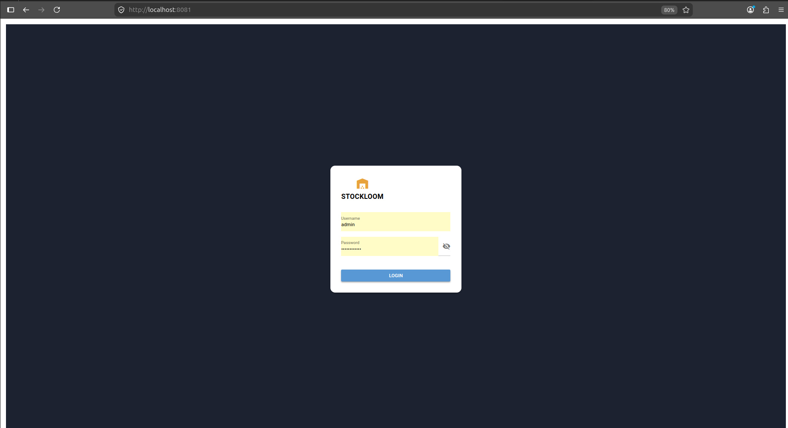

#### Demo Credentials

> ⚠️ **Warning:** These are demo/local credentials only. Never use hardcoded credentials like this in a real production environment — use environment variables or a secrets manager (e.g. AWS Secrets Manager, Kubernetes Secrets) instead.

| Field    | Value          |
|----------|----------------|
| Username | `Admin`        |
| Password | `Stockloom123` |

### 🖥️ Frontend

The frontend is served through NiceGUI and communicates with the FastAPI backend.

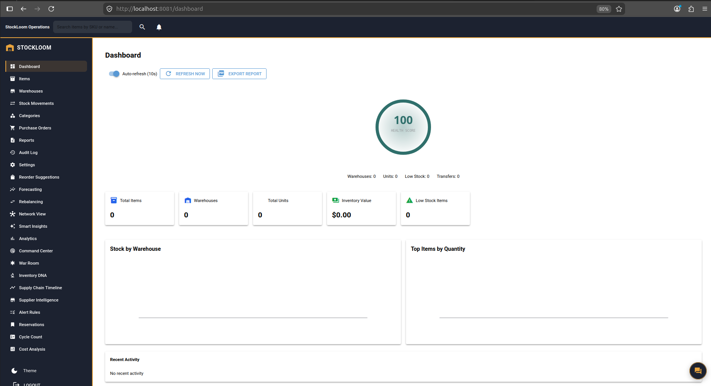

### ⚡ Backend API

FastAPI provides the backend REST API along with auto-generated Swagger documentation.

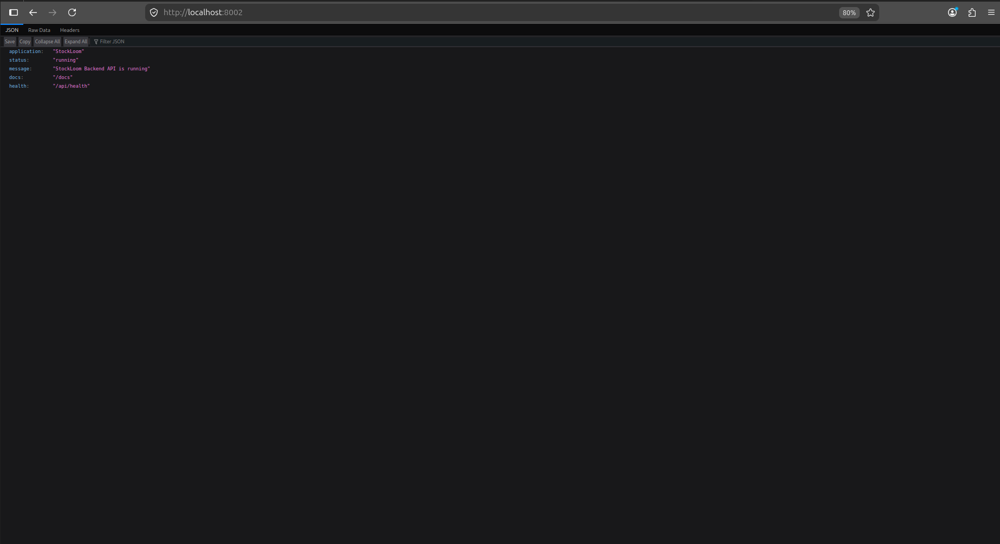

### 🔗 Local URLs

| Service  | URL                              |
|----------|-----------------------------------|
| Frontend | http://localhost:8081             |
| Backend  | http://localhost:8000             |
| Swagger  | http://localhost:8000/docs        |

---

## 🐳 Docker

Docker and Docker Compose are used to containerize and run StockLoom in a reproducible environment.

**Check Docker installation**
```bash
docker --version
docker compose version
```

**Clone the repository**
```bash
git clone https://github.com/Apurvbajpai2531/Stockloom.git
cd Stockloom
```

**Build and start all services**
```bash
docker compose up --build -d
```
`--build` rebuilds the images before starting the containers. `-d` runs them in detached (background) mode.

**Check running containers**
```bash
docker compose ps
```

**View logs — all services**
```bash
docker compose logs -f
```

**View logs — backend only**
```bash
docker compose logs -f backend
```

**View logs — frontend only**
```bash
docker compose logs -f frontend
```

**Stop the application**
```bash
docker compose down
```

**Stop and remove volumes (deletes local DB data)**
```bash
docker compose down -v
```
`-v` also removes Docker volumes, so use this only when you want to wipe local database data.

---

## 🔐 DevSecOps

Security is integrated directly into the CI/CD pipeline using GitHub Actions.

```
Developer
    ↓
Git Push
    ↓
GitHub Actions
    ↓
Code Quality
    ↓
Unit Tests
    ↓
SAST / Semgrep
    ↓
Secret Scanning
    ↓
Dependency Scanning
    ↓
Dockerfile Scanning
    ↓
Trivy Image Scan
    ↓
Docker Build & Push
    ↓
Argo CD
    ↓
AWS EKS
```

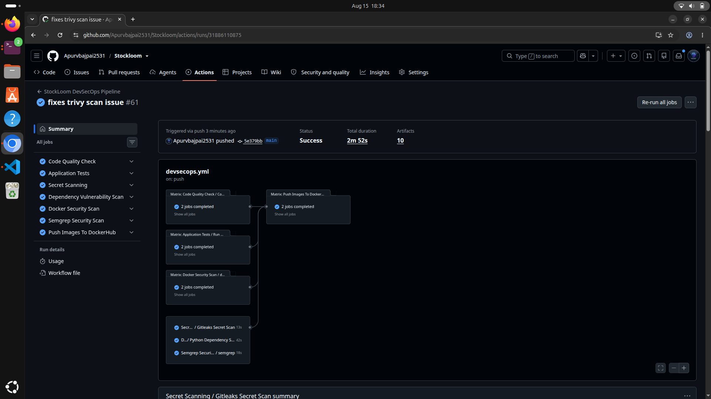

### GitHub Actions Workflows

All workflows are maintained under `.github/workflows/`:

- `code-test.yml` — runs the automated test suite
- `code-quality.yml` — runs linting and formatting checks
- `lint.yml` — validates code style
- `semgrep-scan.yml` — runs Semgrep SAST scanning
- `dependency-scan.yml` — checks dependencies for known vulnerabilities
- `secret-scanning.yml` — runs Gitleaks to detect committed secrets
- `docker-scans.yml` — scans Docker images with Trivy
- `docker-push.yml` — builds and pushes Docker images to the registry
- `devsecops.yml` — orchestrates the full security pipeline

**List workflow files**
```bash
ls -la .github/workflows/
```

**View a specific workflow**
```bash
cat .github/workflows/semgrep-scan.yml
```

---

## 🔎 SOTA / Security Analysis

### Semgrep (SAST)

Semgrep performs Static Application Security Testing to catch insecure coding patterns before deployment.

**Install Semgrep**
```bash
python3 -m pip install semgrep
```

**Run a full automatic scan**
```bash
semgrep scan --config auto .
```

**Run the CI-configured scan**
```bash
semgrep ci
```

**Scan a specific directory**
```bash
semgrep scan --config auto backend/
```

**Save results as JSON**
```bash
semgrep scan --config auto . --json > semgrep-results.json
```

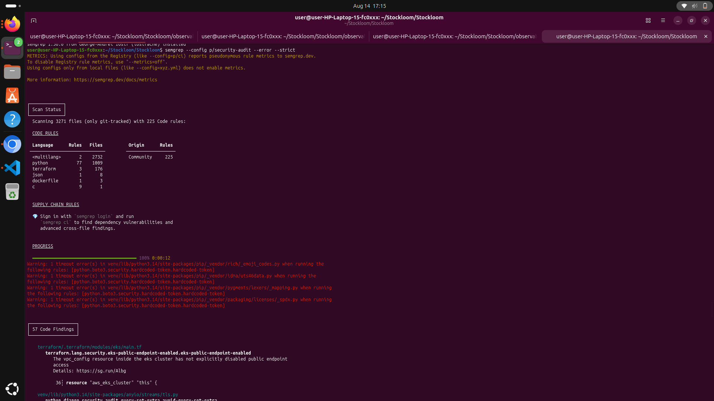

### Trivy

Trivy scans for vulnerabilities across the filesystem, container images and Kubernetes configs.

**Filesystem scan**
```bash
trivy fs .
```

**Docker image scan**
```bash
trivy image stockloom-backend:latest
```

**Kubernetes config scan**
```bash
trivy config k8s/
```

**Only show HIGH/CRITICAL severity**
```bash
trivy image --severity HIGH,CRITICAL stockloom-backend:latest
```

**Ignore vulnerabilities with no available fix**
```bash
trivy image --ignore-unfixed --severity HIGH,CRITICAL stockloom-backend:latest
```

### Gitleaks

Gitleaks detects secrets and credentials accidentally committed to the repository.

**Scan current repository state**
```bash
gitleaks detect --source . --verbose
```

**Scan full Git history**
```bash
gitleaks git --verbose
```

### Bandit

Bandit performs static security analysis on Python source code.

```bash
bandit -r backend frontend agentic_ai
```

**Generate a JSON report**
```bash
bandit -r backend frontend agentic_ai -f json -o bandit-report.json
```

### pip-audit

pip-audit checks Python dependencies against known vulnerability databases.

**Backend**
```bash
pip-audit -r backend/requirements.txt
```

**Frontend**
```bash
pip-audit -r frontend/requirements.txt
```

### Hadolint

Hadolint lints Dockerfiles for common mistakes and security anti-patterns.

**Backend Dockerfile**
```bash
hadolint backend/Dockerfile
```

**Frontend Dockerfile**
```bash
hadolint frontend/Dockerfile
```

### Code Quality

**Ruff — Python linting**
```bash
ruff check .
```

**Black — formatting check**
```bash
black --check .
```

**MyPy — static type checking**
```bash
mypy backend
```

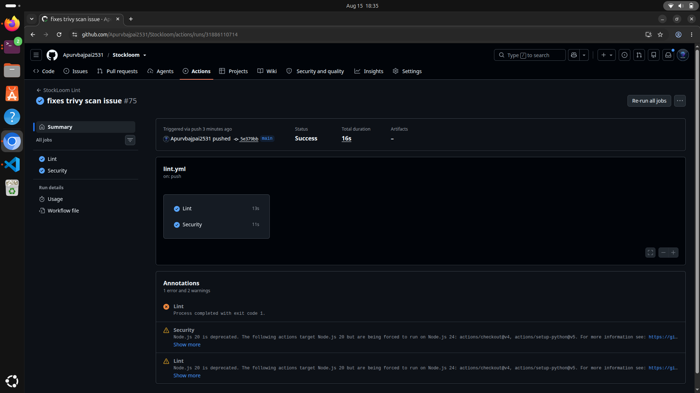

---

## 🏗️ Terraform — AWS Infrastructure

Terraform provisions the AWS infrastructure required by StockLoom.

```
AWS
 ├── VPC
 ├── Subnets
 ├── Route Tables
 ├── Internet Gateway
 ├── Security Groups
 ├── IAM
 └── EKS
      ├── Control Plane
      └── Worker Nodes
```

**Enter the Terraform directory**
```bash
cd terraform
```

**Initialize Terraform**
```bash
terraform init
```
Downloads the required providers and initializes the working directory.

**Format configuration files**
```bash
terraform fmt -recursive
```

**Validate configuration syntax**
```bash
terraform validate
```

**Preview the execution plan**
```bash
terraform plan
```
Shows exactly what Terraform will create, modify or destroy.

**Apply the infrastructure**
```bash
terraform apply
```

**View outputs**
```bash
terraform output
```

**List managed resources**
```bash
terraform state list
```

**Show current state**
```bash
terraform show
```

**Destroy infrastructure**
```bash
terraform destroy
```
Use this only when the infrastructure is no longer required — it is destructive and irreversible.

---

## ⚙️ Ansible Automation

Ansible handles configuration management and operational automation.

```
ansible/
├── ansible.cfg
├── inventory/
├── playbooks/
└── roles/
```

**Verify Ansible installation**
```bash
ansible --version
```

**Check inventory**
```bash
ansible-inventory -i ansible/inventory/hosts.ini --list
```

**Test connectivity to all hosts**
```bash
ansible all -i ansible/inventory/hosts.ini -m ping
```

**Validate a playbook (syntax check only)**
```bash
ansible-playbook --syntax-check -i ansible/inventory/hosts.ini ansible/playbooks/site.yml
```

**Run a playbook**
```bash
ansible-playbook -i ansible/inventory/hosts.ini ansible/playbooks/site.yml
```

---

## 🧪 Local Kubernetes Setup with Minikube

Before deploying to AWS EKS, the full GitOps + Observability stack (Argo CD, Prometheus, Grafana, Loki) was first set up and tested locally on **Minikube**. This is useful for anyone who wants to try the whole stack without spinning up real AWS infrastructure.

**Install Minikube (if not already installed)**
```bash
minikube version
```

**Start a local cluster**
```bash
minikube start --cpus=4 --memory=8192 --driver=docker
```
Allocates 4 CPUs and 8 GB RAM to the local cluster using the Docker driver. Adjust based on your machine.

**Verify the cluster is running**
```bash
minikube status
kubectl cluster-info
kubectl get nodes
```

**Enable useful addons**
```bash
minikube addons enable ingress
minikube addons enable metrics-server
```

**Open the Minikube dashboard (optional, for a visual view of the cluster)**
```bash
minikube dashboard
```

### Deploy the App on Minikube
```bash
kubectl create namespace stockloom
kubectl apply -f k8s/
kubectl get pods -n stockloom
```

### Install Argo CD on Minikube
```bash
kubectl create namespace argocd
kubectl apply -n argocd -f https://raw.githubusercontent.com/argoproj/argo-cd/stable/manifests/install.yaml
kubectl get pods -n argocd
```

**Access the Argo CD UI locally**
```bash
kubectl port-forward svc/argocd-server -n argocd 8080:443
```
Then open `https://localhost:8080` and log in using the initial admin password (see the Argo CD section below for the command to retrieve it).

### Install Prometheus + Grafana on Minikube
```bash
helm repo add prometheus-community https://prometheus-community.github.io/helm-charts
helm repo update
kubectl create namespace monitoring
helm install kube-prometheus-stack prometheus-community/kube-prometheus-stack -n monitoring
kubectl get pods -n monitoring
```

### Install Loki on Minikube
```bash
helm repo add grafana https://grafana.github.io/helm-charts
helm repo update
helm upgrade --install loki grafana/loki -n monitoring --create-namespace
kubectl get pods -n monitoring | grep loki
```

**Stop the local cluster when done**
```bash
minikube stop
```

**Delete the local cluster completely**
```bash
minikube delete
```

Once the workflow is verified locally on Minikube, the same Helm charts and Kubernetes manifests are applied to the production AWS EKS cluster — see the section below.

---

## ☁️ AWS EKS

StockLoom is deployed on Amazon EKS for production.

**Configure kubectl to point to the EKS cluster**
```bash
aws eks update-kubeconfig --region ap-south-1 --name stockloom-eks
```
This command fetches the EKS cluster's connection details and adds/updates a `kubectl` context for it, so your local `kubectl` can talk to the cloud cluster.

**Verify cluster connection**
```bash
kubectl cluster-info
```

### Switching Between Minikube and AWS EKS

If you've been working on Minikube locally and now want to switch `kubectl` to point at the AWS EKS cluster (or back), use context switching instead of reconfiguring everything each time.

**List all available contexts (Minikube, EKS, etc.)**
```bash
kubectl config get-contexts
```

**Check which context is currently active**
```bash
kubectl config current-context
```

**Switch to the AWS EKS cluster**
```bash
kubectl config use-context arn:aws:eks:ap-south-1:<account-id>:cluster/stockloom-eks
```
On most systems, `aws eks update-kubeconfig` (above) automatically creates this context name and switches to it — this command is only needed if you have multiple contexts and want to switch back manually.

**Switch back to Minikube**
```bash
kubectl config use-context minikube
```

**Check nodes**
```bash
kubectl get nodes
```

**Detailed node information**
```bash
kubectl get nodes -o wide
```

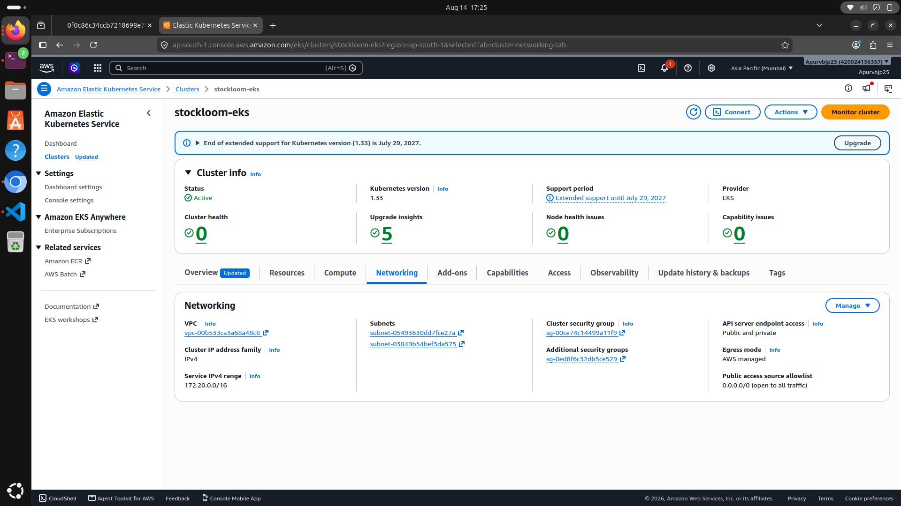
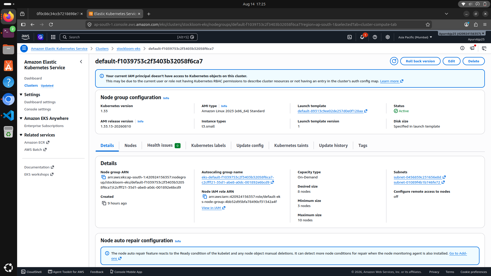
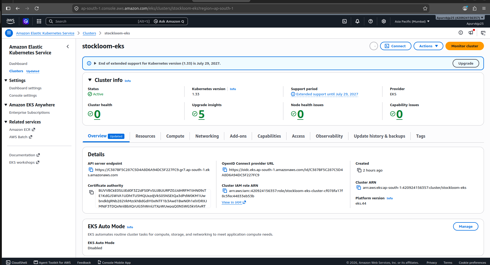
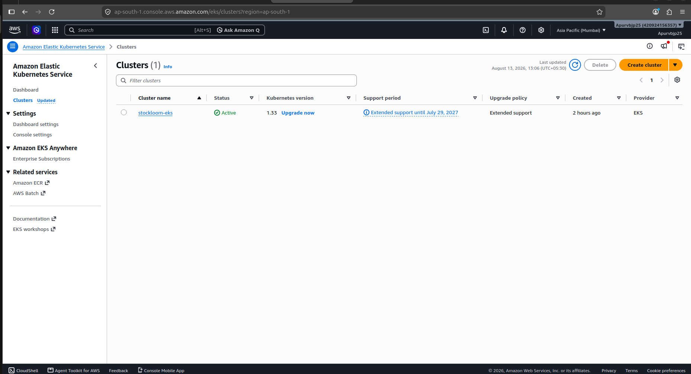
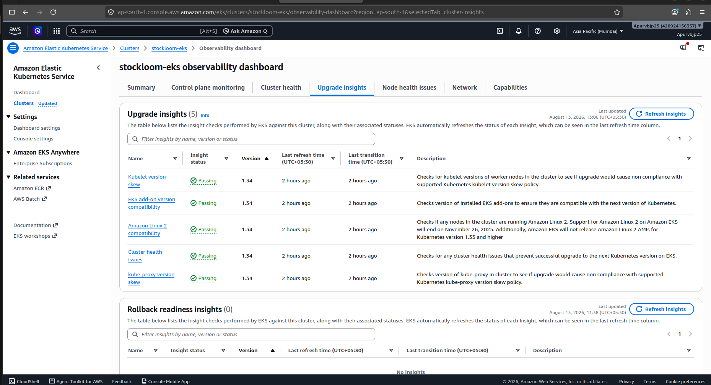

---

## ☸️ Kubernetes

**Create the application namespace**
```bash
kubectl create namespace stockloom
```

**Deploy the application**
```bash
kubectl apply -f k8s/
```

**Check all resources**
```bash
kubectl get all -n stockloom
```

**Check pods**
```bash
kubectl get pods -n stockloom
```

**Watch pods in real time**
```bash
kubectl get pods -n stockloom -w
```

**Check services**
```bash
kubectl get svc -n stockloom
```

**Describe a pod (for debugging)**
```bash
kubectl describe pod <pod-name> -n stockloom
```

**View pod logs**
```bash
kubectl logs <pod-name> -n stockloom
```

**Follow pod logs**
```bash
kubectl logs -f <pod-name> -n stockloom
```

**Check deployments**
```bash
kubectl get deployments -n stockloom
```

**Check rollout status**
```bash
kubectl rollout status deployment/<deployment-name> -n stockloom
```

**Rollback a deployment**
```bash
kubectl rollout undo deployment/<deployment-name> -n stockloom
```

---

## ⎈ Helm

Helm is used to install and manage Kubernetes components.

**Add the Prometheus community repo**
```bash
helm repo add prometheus-community https://prometheus-community.github.io/helm-charts
```

**Add the Grafana repo**
```bash
helm repo add grafana https://grafana.github.io/helm-charts
```

**Update repositories**
```bash
helm repo update
```

**List installed releases**
```bash
helm list -A
```

**List added repositories**
```bash
helm repo list
```

---

## 🔄 Argo CD — GitOps

Argo CD continuously synchronizes the Kubernetes state from GitHub to EKS.

```
GitHub
   ↓
Argo CD
   ↓
Kubernetes / EKS
```

**Create the Argo CD namespace**
```bash
kubectl create namespace argocd
```

**Install Argo CD**
```bash
kubectl apply -n argocd -f https://raw.githubusercontent.com/argoproj/argo-cd/stable/manifests/install.yaml
```

**Check Argo CD pods**
```bash
kubectl get pods -n argocd
```

**Check Argo CD services**
```bash
kubectl get svc -n argocd
```

**Port-forward the Argo CD UI**
```bash
kubectl port-forward svc/argocd-server -n argocd 8080:443
```

**Get the initial admin password**
```bash
kubectl -n argocd get secret argocd-initial-admin-secret -o jsonpath="{.data.password}" | base64 -d
```

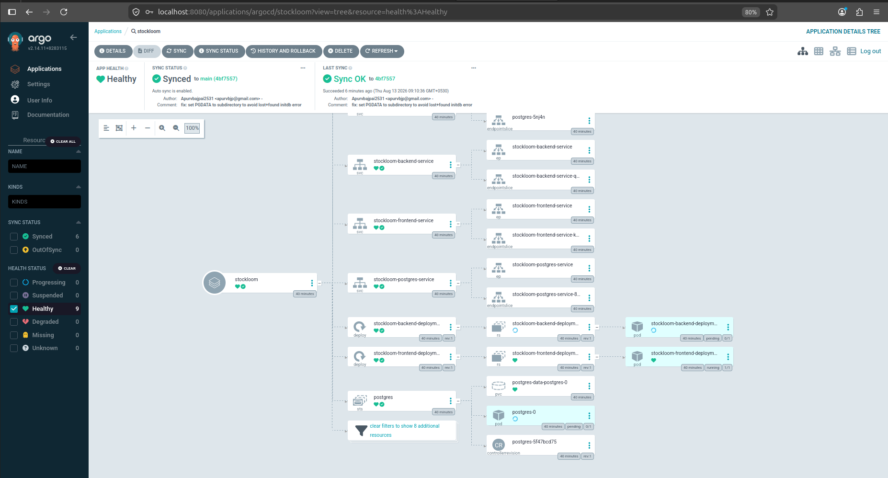

---

## 📊 Prometheus

Prometheus collects Kubernetes and application metrics.

**Create the monitoring namespace**
```bash
kubectl create namespace monitoring
```

**Install kube-prometheus-stack**
```bash
helm install kube-prometheus-stack prometheus-community/kube-prometheus-stack -n monitoring
```

**Check monitoring pods**
```bash
kubectl get pods -n monitoring
```

**Check services**
```bash
kubectl get svc -n monitoring
```

**Access the Prometheus UI**
```bash
kubectl port-forward svc/kube-prometheus-stack-prometheus -n monitoring 9090:9090
```
Then open: `http://localhost:9090`

Prometheus monitors: CPU, Memory, Nodes, Pods, Kubernetes resources, and application metrics.

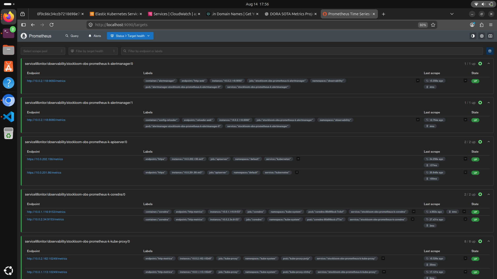

---

## 📈 Grafana

Grafana provides dashboards for metrics, logs and traces.

**Port-forward the Grafana UI**
```bash
kubectl port-forward svc/kube-prometheus-stack-grafana -n monitoring 3000:80
```
Then open: `http://localhost:3000`

**Get the Grafana admin password**
```bash
kubectl get secret kube-prometheus-stack-grafana -n monitoring -o jsonpath="{.data.admin-password}" | base64 -d
```

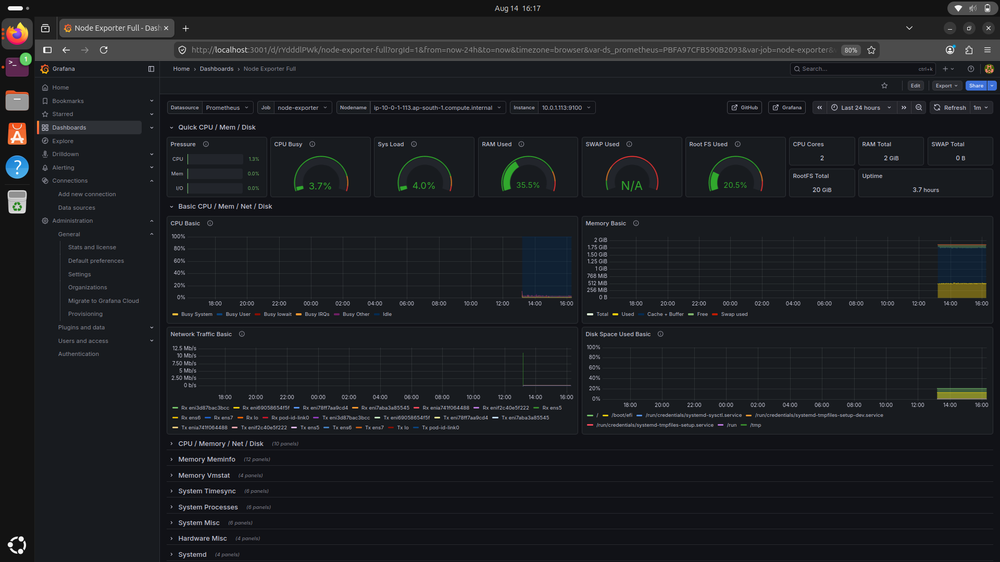

---

## 📝 Loki — Centralized Logging

Loki provides centralized Kubernetes and application logging.

**Install Loki**
```bash
helm upgrade --install loki grafana/loki -n monitoring --create-namespace
```

**Check Loki pods**
```bash
kubectl get pods -n monitoring | grep loki
```

Logging flow:
```
Kubernetes Pods
      ↓
Log Collector
      ↓
Loki
      ↓
Grafana
```

---

## 🔭 Tempo — Distributed Tracing

Tempo provides distributed tracing for application requests.

**Install Tempo**
```bash
helm upgrade --install tempo grafana/tempo -n monitoring
```

**Check Tempo pods**
```bash
kubectl get pods -n monitoring | grep tempo
```

Tracing flow:
```
Frontend
   ↓
FastAPI
   ↓
PostgreSQL / Agentic AI
```

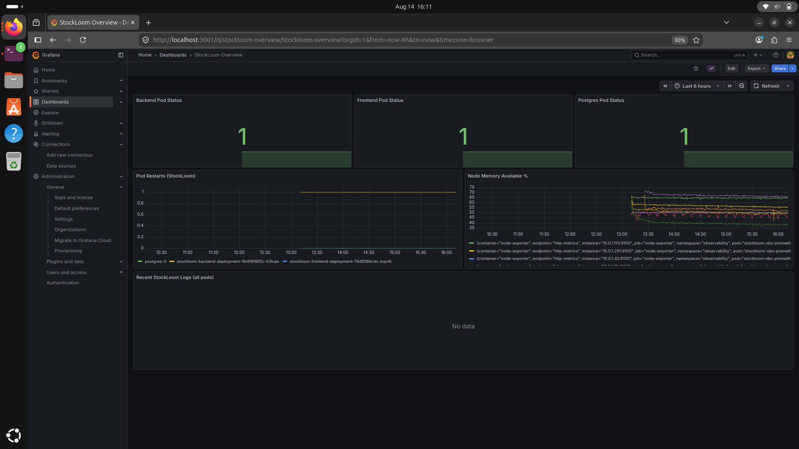

---

## 📡 OpenTelemetry

OpenTelemetry provides a standard telemetry layer for metrics, logs and traces.

```
StockLoom
    ↓
OpenTelemetry
    ├──→ Prometheus
    ├──→ Loki
    └──→ Tempo
             ↓
          Grafana
```

This provides unified observability across the entire application.

---

## 📈 DORA Metrics

StockLoom tracks the four core DORA metrics:

| Metric | Description |
|--------|-------------|
| **Deployment Frequency** | How frequently successful deployments are delivered |
| **Lead Time for Changes** | Time between a code change and successful deployment |
| **Change Failure Rate** | Percentage of deployments resulting in failure or requiring recovery |
| **MTTR** | Mean time required to restore service after a failure |

```
Git Commit
    ↓
GitHub Actions
    ↓
Docker Build
    ↓
Registry
    ↓
Argo CD
    ↓
EKS Deployment
```

DORA metrics are visualized through Grafana using deployment and application telemetry.

> 📸 Add your DORA dashboard screenshot as `Images/Grafana-dora.png` once exported from Grafana — it isn't in the `Images/` folder yet.

```
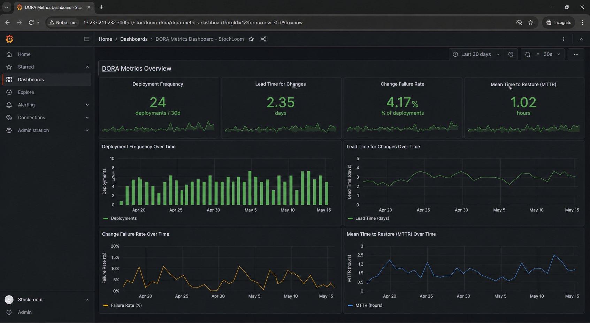
```

---

## 🤖 Agentic AI

StockLoom contains a dedicated Agentic AI service integrated with Ollama.

```
FastAPI
   ↓
Agentic AI
   ↓
Ollama
   ↓
Local LLM
```

The agent supports:
- Inventory analysis
- Low-stock recommendations
- Demand forecasting
- Purchase recommendations
- Natural-language inventory queries
- Warehouse insights

---

## 🔗 Complete Deployment Flow

```
Developer
   ↓
GitHub
   ↓
GitHub Actions
   ↓
Security + Quality
   ↓
Docker Build
   ↓
Docker Registry
   ↓
Argo CD
   ↓
AWS EKS
   ↓
StockLoom
   ↓
OpenTelemetry
   ├── Prometheus ──→ Grafana
   ├── Loki ────────→ Grafana
   └── Tempo ───────→ Grafana
```

---

## 🎯 Key Highlights

☁️ AWS EKS · 🏗️ Terraform · ⚙️ Ansible · ☸️ Kubernetes · ⎈ Helm · 🔄 Argo CD GitOps · 🐳 Docker · 🔐 DevSecOps · 🔎 Semgrep SAST · 🛡️ Trivy · 🔑 Gitleaks · 🐍 Bandit · 📦 pip-audit · 🐳 Hadolint · 📊 Prometheus · 📈 Grafana · 📝 Loki · 🔭 Tempo · 📡 OpenTelemetry · 📈 DORA Metrics · 🤖 Agentic AI + Ollama

---

## 👨‍💻 Author

**Apurv Bajpai**

A hands-on Cloud Native • DevSecOps • SRE • GitOps • Agentic AI project.

Built as part of the **90 Days of DevOps** challenge.

🚀 #TrainWithShubham · #90DaysOfDevOps